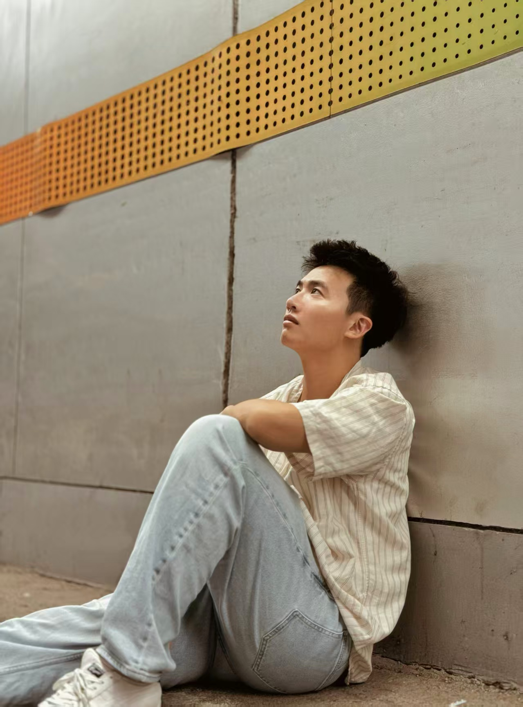

We are a team based in the [School of Computing, National University of Singapore](https://www.comp.nus.edu.sg).

You can reach us at the email `seer[at]comp.nus.edu.sg`

## Project team

### Chua Chloe

[[github](http://github.com/sqonky1)]

* Role: Developer
* Responsibilities: UI, Deliverables, Deadlines

### Zhang Zhuoyu

[[github](https://github.com/wumingxin238)]

* Role: Developer, Model IC
* Responsibilities: In charge of the Model Folder

### Nguyen Thai Binh

[[github](https://github.com/nutabi)]

* Role: Developer
* Responsibilities: Testing IC, Storage
