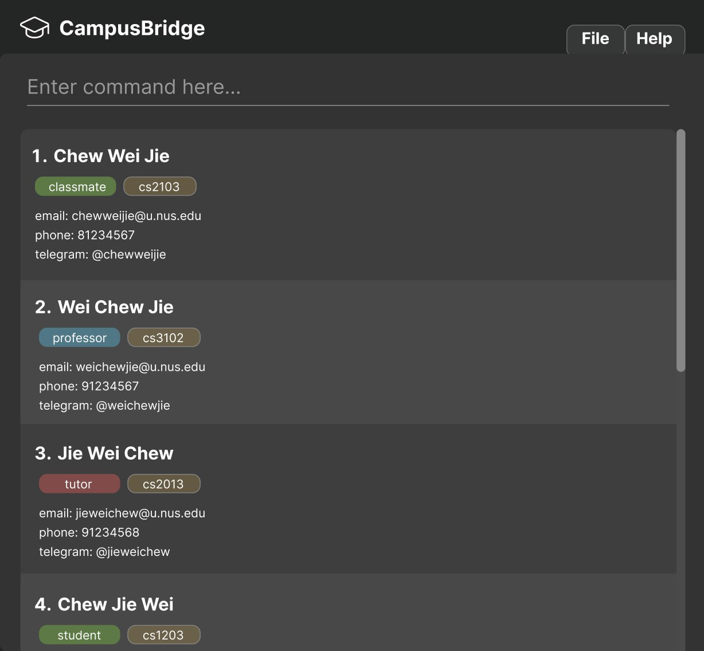

CampusBridge is a **desktop app for managing contacts, optimized for use via a Command Line Interface** (CLI) while still having the benefits of a Graphical User Interface (GUI). If you can type fast, CampusBridge can get your contact management tasks done faster than traditional GUI apps.

* Table of Contents
{:toc}

--------------------------------------------------------------------------------------------------------------------

## Quick start

1. Ensure you have Java `17` or above installed in your Computer. 
   **Mac users:** Ensure you have the precise JDK version prescribed [here](https://se-education.org/guides/tutorials/javaInstallationMac.html).

1. Download the latest `.jar` file from [here](https://github.com/se-edu/addressbook-level3/releases).

1. Copy the file to the folder you want to use as the _home folder_ for your CampusBridge application.

1. Open a command terminal, `cd` into the folder you put the jar file in, and use the `java -jar addressbook.jar` command to run the application. 
   A GUI similar to the below should appear in a few seconds. Note how the app contains some sample data. 
   

1. Type the command in the command box and press Enter to execute it. e.g. typing **`help`** and pressing Enter will open the help window. 
   Some example commands you can try:

   * `list` : Lists all contacts.

   * `add n/John Doe e/johnd@example.com p/98765432 h/johndoe123 t/friend` : Adds a contact named `John Doe` to CampusBridge.

   * `find n/John` : Finds all contacts whose names contain `John`.

   * `delete i/3` : Deletes the 3rd contact shown in the current list.

   * `clear` : Deletes all contacts.

   * `exit` : Exits the app.

1. Refer to the [Features](#features) below for details of each command.

--------------------------------------------------------------------------------------------------------------------

## Features

**:information_source: Notes about the command format:** 

* Words in `UPPER_CASE` are the parameters to be supplied by the user. 
  e.g. in `add n/NAME`, `NAME` is a parameter which can be used as `add n/John Doe`.

* Items in square brackets are optional. 
  e.g `n/NAME [t/TAG]` can be used as `n/John Doe t/friend` or as `n/John Doe`.

* Items with `…`​ after them can be used multiple times including zero times. 
  e.g. `[t/TAG]…​` can be used as ` ` (i.e. 0 times), `t/friend`, `t/friend t/family` etc.

* Parameters can be in any order. 
  e.g. if the command specifies `n/NAME p/PHONE_NUMBER`, `p/PHONE_NUMBER n/NAME` is also acceptable.

* Extraneous parameters for commands that do not take in parameters (such as `help`, `list`, `exit` and `clear`) will be ignored. 
  e.g. if the command specifies `help 123`, it will be interpreted as `help`.

* Prefixes are case-insensitive. 
  e.g. n/NAME and N/NAME are treated the same way.

* If you are using a PDF version of this document, be careful when copying and pasting commands that span multiple lines as space characters surrounding line-breaks may be omitted when copied over to the application.

### Tag types

CampusBridge supports three tag types, each displayed in a distinct colour:

| Tag type | Colour | Purpose | Example |
|----------|--------|---------|---------|
| **Role** | Green | Academic role of the contact | `Professor`, `TeachingAssistant` |
| **Course** | Blue | NUS course code associated with the contact | `CS2103T`, `CS2101` |
| **General** | Red | Any other label | `ProjectMate`, `StudyGroup` |

When adding or editing tags, prefix the tag name with the type:
* `tr/TAG` — creates a Role tag
* `tc/TAG` — creates a Course tag
* `t/TAG` — creates a General tag

### Viewing help : `help`

Opens the help window with a link to this user guide, or opens the user guide directly to the section for a specific command.

Format: `help [COMMAND]`

* `COMMAND` is optional. When provided, it must be a valid command name (e.g. `add`, `edit`).
* If `COMMAND` is omitted, the help window is shown.
* If `COMMAND` is provided, your browser opens the user guide at the section for that command.

Examples:
* `help` — opens the help window.
* `help add` — opens the user guide at the **Adding a person** section.
* `help sort` — opens the user guide at the **Sorting persons** section.

### Adding a person: `add`

Adds a person to the address book.

Format: `add n/NAME e/EMAIL [p/PHONE_NUMBER] [h/TELEGRAM_HANDLE]`

* `n/NAME` and `e/EMAIL` are required.
* `p/PHONE_NUMBER` and `h/TELEGRAM_HANDLE` are optional.
* If no phone number is provided, the contact will be created without one.
* If no Telegram handle is provided, the contact will be created without one.
* Email must be unique. You cannot add two persons with the same email address.

:bulb: **Tip:**
Parameters can be entered in any order, as long as each value is preceded by the correct prefix.

Examples:
* `add n/John Doe e/johnd@example.com`
* `add n/Betsy Crowe e/betsycrowe@example.com p/1234567`
* `add n/Alex Lim e/alexlim@example.com h/alex_lim123`
* `add e/berniceyu@example.com n/Bernice Yu p/98765432 h/bernice_yu`

### Tagging a person: `tag`

Adds one or more tags to an existing person in the address book.

Format: `tag INDEX [tr/ROLE_TAG]…​ [tc/COURSE_TAG]…​ [tg/GENERAL_TAG]…​`

* Adds tags to the person at the specified `INDEX`.
* The index refers to the index number shown in the displayed person list.
* Multiple tags (of different or same types) can be added in a single command.
* Existing tags will be preserved. New tags are appended.
* Tag matching is **case-insensitive**. e.g. `friends` and `FRIENDS` are considered the same.
* Duplicate tags will not be added again.

Constraints:
* The index **must be a positive integer** 1, 2, 3, …​
* Tag names must be **alphanumeric** (no space or symbols).
* At least one of the optional fields must be provided.

:bulb: **Tip:**
Obtain the index by using: `list` command to display all persons or `find` command to filter the persons.

Examples:
* `tag 1 tg/friends`   
Adds the `friends` general tag to the 1st person in the displayed list.

* `tag 2 tr/tutor tc/cs2103 tg/helpful`  
Adds the `tutor` role tag, `cs2103` course tag and `helpful` general tag to the 2nd person in the displayed list.

* `tag 3 tg/friends tg/groupmates`  
Adds both `friends` and `groupmates` general tags to the 3rd person in the displayed list.

### Untagging a person: `untag`

Removes one or more tags from an existing person in the address book.

Format: `untag INDEX [tr/ROLE_TAG]…​ [tc/COURSE_TAG]…​ [tg/GENERAL_TAG]…​`

* Removes the specified tags from the person at the given `INDEX`.
* The index refers to the index number shown in the displayed person list.
* Multiple tags (of different or same types) can be removed in a single command. 
* Only tags currently assigned to the person will be removed.
* Existing tags that are not specified will remain unchanged.
* Tag matching is **case-insensitive**. e.g. `friends` and `FRIENDS` are considered the same.
* Duplicate tags in the command will be ignored.

Partial removal behavior:
* If some tags exist and others don't, the existing ones will be removed and a message will show which tags were not found.
* If none of the specified tags exist, an error message will be shown and no changes will be made.

Constraints:
* The index **must be a positive integer** 1, 2, 3, …​
* Tag names must be **alphanumeric** (no space or symbols).
* At least one of the optional fields must be provided.

:bulb: **Tip:**
Obtain the index by using: `list` command to display all persons or `find` command to filter the persons.

Examples:
* `untag 1 tg/friends`  
Removes the `friends` general tag from the 1st person in the list.

* `untag 2 tr/tutor tc/cs2103 tg/classmates`  
Removes the `tutor` role tag, `cs2103` course tag and `classmates` general tag from the 2nd person in the list.

* `untag 3 tc/cs2103 tc/cs2109`  
Removes both `cs2103` and `cs2109` course tags from the 3rd person in the list.

## Clearing tags from a person: `cleartag`

Clears all tags of a specific type from an existing person in the address book.

Format: `cleartag INDEX [tr/] or [tc/] or [tg/]`

* Clears all tags of the specified type from the person at the given `INDEX`.
* The index refers to the index number shown in the displayed person list.
* Only one tag type can be cleared at a time.
* Only tags of the specified type will be removed. Tags of other types remain unchanged.

Constraints:
* The index **must be a positive integer** 1, 2, 3, …​
* **Exactly one tag type prefix** must be provided.

:bulb: **Tip:**
Obtain the index by using: `list` command to display all persons or `find` command to filter the persons.

Examples:
* `cleartag 1 tg/`  
Clears all general tags from the 1st person in the displayed list.

* `cleartag 2 tr/`  
Clears all role tags from the 2nd person in the displayed list.

### Listing all persons : `list`

Shows a list of all persons in the address book.

Format: `list`

### Sorting persons : `sort`

Sorts the list of persons by the specified order.

Format: `sort o/ORDER [r/]`

* `ORDER` is case-insensitive. The currently supported value is:
  * `name` — sorts persons alphabetically by name (A–Z)
* The `r/` flag is optional. When included, the sort order is reversed (Z–A for `name`).

Examples:
* `sort o/name` sorts all persons alphabetically by name.
* `sort o/name r/` sorts all persons in reverse alphabetical order.

### Editing a person : `edit`

Edits an existing person in the address book.

Format: `edit INDEX [n/NAME] [p/PHONE] [e/EMAIL] [h/TELEGRAM_HANDLE]`

* Edits the person at the specified `INDEX`. 
* The index refers to the index number shown in the displayed person list. 
* The index **must be a positive integer** 1, 2, 3, …​
* At least one of the optional fields must be provided.
* Existing values will be updated to the input values.

Examples:
*  `edit 1 p/91234567 e/johndoe@example.com` Edits the phone number and email address of the 1st person to be `91234567` and `johndoe@example.com` respectively.
*  `edit 2 n/Betsy Crower h/betsyy` Edits the name of the 2nd person to be `Betsy Crower` and the telegram handle to be `betsyy`.

### Locating persons by name/email/tag: `find`

Finds persons whose names, emails, or tags match the given keywords.

Format: `find [n/NAME [MORE_NAMES]] [e/EMAIL [MORE_EMAILS]] [t/TAG [MORE_TAGS]]`

* At least one of `n/`, `e/`, or `t/` must be present.
* The search is case-insensitive for all fields. e.g. `hans` will match `Hans`
* The order of keywords does not matter. e.g. `Hans Bo` will match `Bo Hans`

**Matching behavior:**
* **Name** and **email** use substring matching.  
  e.g. `Jo` will match `John` and `Alice Johnson`
* **Tags** use exact matching.  
  e.g. `cs2103` will match tag `cs2103` but not `cs210`
* Multiple keywords within the same field are combined using **OR**.  
  e.g. `n/Alex David` will match `Alex Yeoh` or `David Li`
* Different fields are combined using **AND**.  
  e.g. `n/Alex e/gmail` will match persons whose name contains `Alex` **and** email contains `gmail`

Examples:
* `find n/John`  
  Returns all persons whose names contain `John`

* `find e/gmail`  
  Returns all persons whose emails contain `gmail`

* `find t/friends`  
  Returns all persons tagged with `friends`

* `find n/alex e/u.nus.edu`  
  Returns persons whose name contains `alex` **and** email contains `u.nus.edu`

* `find n/alex t/friends`  
  Returns persons whose name contains `alex` **and** are tagged with `friends` 

* `find n/alex e/nus t/friends`  
  Returns persons whose name contains `alex` **and** email contains `nus` **and** are tagged with `friends`

* `find n/alex david`  
  Returns persons whose name contains `alex` **or** `david`
  

### Deleting a person : `delete`

Deletes the specified person from the address book.

Format: 
* `delete i/INDEX`
  * Deletes the person at the specified `INDEX`. 
  * The index refers to the index number shown in the displayed person list.
  * The index **must be a positive integer** 1, 2, 3, …​

* `delete e/EMAIL`
  * Deletes the person with the specified `EMAIL`.
  * The email refers to the email address of a person shown in the displayed person list.
  * The email **must be a valid email address**. 
  * Email matching is **case-insensitive**.

:information_source: **NOTE:**
Only one of `i/INDEX` or `e/EMAIL` can be provided at a time.

Examples:
* Delete by index
  * `list` followed by `delete i/2` deletes the 2nd person in the address book.
  * `find n/Betsy` followed by `delete i/1` deletes the 1st person in the results of the `find` command.
  
* Delete by email
  * `list` followed by `delete e/betsy@example.com` deletes the person with email `betsy@example.com` in the address book.
  * `find n/Betsy` followed by `delete e/BETSY@example.com` deletes the person with email `BETSY@example.com` in the results of the `find` command (case-insensitive match also works).

### Clearing all entries : `clear`

Clears all entries from the address book.

Format: `clear`

### Exiting the program : `exit`

Exits the program.

Format: `exit`

### Saving the data

CampusBridge data are saved in the hard disk automatically after any command that changes the data. There is no need to save manually.

### Editing the data file

CampusBridge data are saved automatically as a JSON file `[JAR file location]/data/addressbook.json`. Advanced users are welcome to update data directly by editing that data file.

:exclamation: **Caution:**
If your changes to the data file makes its format invalid, CampusBridge will discard all data and start with an empty data file at the next run. Hence, it is recommended to take a backup of the file before editing it. 
Furthermore, certain edits can cause CampusBridge to behave in unexpected ways (e.g., if a value entered is outside of the acceptable range). Therefore, edit the data file only if you are confident that you can update it correctly.

### Archiving data files `[coming in v2.0]`

_Details coming soon ..._

--------------------------------------------------------------------------------------------------------------------

## FAQ

**Q**: How do I transfer my data to another Computer? 
**A**: Install the app in the other computer and overwrite the empty data file it creates with the file that contains the data of your previous CampusBridge home folder.

--------------------------------------------------------------------------------------------------------------------

## Known issues

1. **When using multiple screens**, if you move the application to a secondary screen, and later switch to using only the primary screen, the GUI will open off-screen. The remedy is to delete the `preferences.json` file created by the application before running the application again.
2. **If you minimize the Help Window** and then run the `help` command (or use the `Help` menu, or the keyboard shortcut `F1`) again, the original Help Window will remain minimized, and no new Help Window will appear. The remedy is to manually restore the minimized Help Window.

--------------------------------------------------------------------------------------------------------------------

## Command summary

Action | Format, Examples
--------|------------------
**Add** | `add n/NAME e/EMAIL [p/PHONE_NUMBER] [h/TELEGRAM_HANDLE]`   e.g., `add n/James Ho e/jamesho@example.com p/22224444 h/james_ho`
**Clear** | `clear`
**Cleartag** | `cleartag INDEX [tr/] or [tc/] or [tg/]`   e.g., `cleartag 1 tg/`
**Delete** | `delete i/INDEX OR delete e/EMAIL`  e.g., `delete i/3 OR delete e/jameslee@example.com `
**Edit** | `edit INDEX [n/NAME] [p/PHONE_NUMBER] [e/EMAIL] [h/TELEGRAM_HANDLE]`  e.g.,`edit 2 n/James Lee e/jameslee@example.com h/jlee01`
**Find** | `find [n/NAME [MORE_NAMES]] [e/EMAIL [MORE_EMAILS]] [t/TAG [MORE_TAGS]]`  e.g., `find n/alex e/gmail t/friends`
**Help** | `help [COMMAND]`  e.g., `help`, `help add`, `help sort`
**List** | `list`
**Sort** | `sort o/ORDER [r/]`  e.g., `sort o/name`, `sort o/name r/`
**Tag** | `tag INDEX [tr/ROLE_TAG]…​ [tc/COURSE_TAG]…​ [tg/GENERAL_TAG]…​`  e.g., `tag 1 tg/friends tc/cs2103`
**Untag** | `untag INDEX [tr/ROLE_TAG]…​ [tc/COURSE_TAG]…​ [tg/GENERAL_TAG]…​`  e.g., `untag 3 tr/tutor tc/cs2103`
